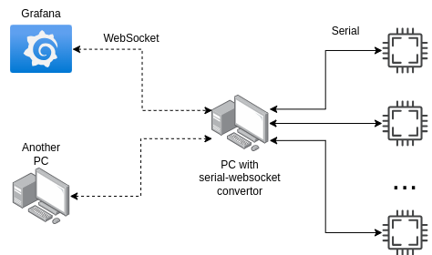

# WebSocket / Serial Converter
<br>
A small utility for transferring data from/to a Serial port (for example, Arduino) using the WebSocket protocol. There is also support for grafana websocket data source.
## Launch: 
#### 1 way
``` bash
$ python -m pip install -r requirements.txt
$ python main.py --port %PORT%
```
#### 2 way
Linux only
``` bash
$ sudo sh install_service.sh %PORT%

$ sudo systemctl daemon-reload
$ sudo systemctl enable WebSocket_Serial_Converter.service
$ sudo systemctl start WebSocket_Serial_Converter.service

$ sudo systemctl status WebSocket_Serial_Converter.service
```
#### 3 way
Build docker image
``` bash
$ sudo docker build .
$ sudo docker run -d -v /dev:/dev -p %PORT%:8800 --privileged %docker ID%
```

#### 4 way
Build docker image
``` bash
$ sudo docker-compose up -d
```
#### 5 way
Run docker image pulled from dockerHUB
``` bash
$ sudo docker run -d -v /dev:/dev -p %PORT%:8800 --privileged blackghostoff/websocketserialconverter
```


## How it works
connect via **postman** to
```
ws://localhost:%PORT%/

For example:
ws://localhost:8802/
```
and get info about connected serial devices:
``` Example!
['/dev/ttyUSB0']
```
To connect to a device
```
ws://localhost:8802/%MODE%/%PARITY%/%BAUDRATE/%SERIAL PORT%

For examle:
ws://localhost:8802/None/N/115200/dev/ttyUSB0
```
```
Parity
N - None
E - Even
O - Odd
M - Mark
S - Space

Modes
1. None - Raw data output/input
2. Grafana - Checks for json data, add posix timestamp to data
```

Messages from the server to the client are sent only after **\n** from device
